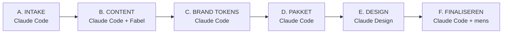

# Pitch Factory — van e-mail tot Claude Design (herhaalbaar proces + skill-ontwerp)

Analyse van hoe we de Corum/Westgate I-pitch bouwden, omgezet naar een **herhaalbaar proces** en het
ontwerp voor een **eigen Claude Code-skill**. Kernprincipe (jouw inzicht): *de opbouw van een voorstel is
altijd hetzelfde — alleen het team, het gebouw en de hoofdvraag veranderen.*

---

## DEEL 1 — Analyse van de route die we liepen

### Wat we deden (chronologisch)
1. Bronnen gelezen: samenvattingsmail aan de klant (Corum/Dirk), M3E-scenario's, ESA-pitch als structuur-
   referentie, vault-projectnotitie.
2. Wireframe gebouwd (python-pptx) = inhoud/structuur.
3. 3 rondes × 5 invalshoeken → MBB-herstructurering (SCQA, action titles, golden thread, twee deep-dives).
4. Boodschap bijgeschaafd op jouw feedback ("PwC fully aware & aligned"; klant-eigen woorden spiegelen).
5. Drie prompts geschreven: Fabel 5 (copy-spec) → Claude Design (wireframe) → Claude Design (styling).
6. Herbruikbare templates + QA gemaakt.
7. CBOE-referentiedeck gevonden (mail Ilse) en geanalyseerd.
8. Fabel → `spec-fabel.md`; wireframe geregenereerd.
9. Styling in code geprobeerd → **afgekeurd** (verkeerd palet + houterig).
10. Eigen PIL-renderer gebouwd om te kunnen zíen.
11. Research "look-and-feel overzetten" → design-tokens-first.
12. CBOE-screenshots → kleuren **pixel-exact gemeten** (navy/amber) → palet gecorrigeerd.
13. Hele deck omgezet; slide 2 in authentieke CBOE-stijl.
14. Claude Design go-brief + vault-opslag.

### Wat goed werkte
- **SCQA + action titles + golden thread** als vaste narratieve ruggengraat.
- **Klant-eigen woorden spiegelen** uit de samenvattingsmail (maakte het scherp en herkenbaar).
- **Design-tokens-first** en **pixel-exact meten** van kleuren uit een screenshot.
- **Eigen renderer** om niet blind te bouwen.
- **Alles vastleggen in de vault** (herbruikbaar geheugen).

### Wat ons tijd kostte (de lessen)
- ❌ **We styleden vóórdat we de merk-tokens hadden** → verkeerd palet (rood i.p.v. navy/amber) → alles opnieuw.
- ❌ **We bouwden blind** (kon pptx niet renderen) → "niet goed gelukt" → renderer kwam te laat.
- ❌ **Referentiedeck (CBOE) pas halverwege geanalyseerd** → hadden dat aan het begin moeten doen.
- ❌ **Fonts nooit hard gemeten** (alleen kleuren) → blijft een open punt.
- ❌ **Te lang geprobeerd het eindresultaat in code te maken** — dat is Claude Design's werk.

**Eén-zin-les:** *Referentie + tokens + ogen aan de vóórkant; content en visuele finish strikt gescheiden.*

---

## DEEL 2 — Het slick herhaalbare stappenplan ("Pitch Factory")

### Wat vast is vs. wat wisselt
| VAST (het sjabloon) | WISSELT per pitch |
|---|---|
| 24-slide narratief (SCQA → deep-dives → journey → governance → fee → beslissing) | **Klant** + profiel + contacten |
| Golden thread `KLANT DECIDES · C&W DELIVERS · HUURDER ALIGNED` | **Gebouw** (adres, m², huurder) |
| CBOE-huisstijl (navy #1F1942 / amber #F4B634 / cream / Arial + serif) | **Hoofdvraag** (de SCQA-Question) |
| CBOE-layoutsysteem (label+descriptor, pull-quotes, tiles, phase-bars) | **Team** (twee-PM-model + namen) |
| De 3-tool-pijplijn + QA-checklist | **Adviseur + scenario's**, fee, referenties, planning |

### De pijplijn (6 fasen)


**A · INTAKE (Claude Code)** — lees automatisch: samenvattingsmail aan klant, adviseursnotities,
updates/threads, vault-projectnotitie. Vul een **variabelen-formulier** (zie skill). Identificeer het
**referentiedeck** (bestaande C&W-pitch). *Output:* `intake.json` + bronnenlijst.

**B · CONTENT (Claude Code → Fabel 5)** — vul het 24-slide sjabloon met de variabelen; Fabel schrijft de
definitieve copy (SCQA, action titles, deep-dives, klant-eigen woorden). *Output:* `spec.md` (24 slides).

**C · BRAND TOKENS (Claude Code)** — haal kleuren **pixel-exact** uit het referentiedeck (screenshot →
sample) en fonts uit het PPTX-thema; val terug op de canonieke vault-tokens. *Output:* `tokens` (navy/amber/…
+ fonts). **Dit gebeurt vóór elke styling.**

**D · PAKKET (Claude Code)** — genereer het **Claude Design go-brief** (tokens + layoutsysteem + per-slide
opmaak + regels), een **kleur/layout-proof** (code-deck via generator + eigen renderer om te checken), en
de attach-lijst. *Output:* `CLAUDE-DESIGN-BRIEF.md` + `spec.md` + `proof.pptx` + referentie-PDF.

**E · DESIGN (Claude Design)** — nieuw PPTX 16:9; attach spec + referentie-PDF + proof; plak de brief;
bevestig fonts; genereer het afgewerkte deck (foto's, echte fonts, echte rendering).

**F · FINALISEREN (Claude Code + mens)** — placeholders vullen (fee, referenties, team), M3E-planning +
technische inhoud verifiëren, NDA-info verwerken, versturen. Vault bijwerken.

---

## DEEL 3 — De skill (blueprint)

**Naam:** `cw-pitch-factory`
**Trigger:** "maak een C&W-pitch / voorstel voor <klant/gebouw>", of "start pitch factory".
**Model-routing:** Opus = intake/structuur/QA/build · Fabel = copy · Claude Design = visuele finish.

### Inputs (het variabelen-schema — het enige dat wisselt)
```json
{
  "client": {"name": "", "profile": "", "contacts": []},
  "building": {"name": "", "address": "", "size_m2": "", "tenant": ""},
  "main_question": "",                       // de SCQA-Question
  "objective": "",                           // bv. Paris Proof (hard/contractueel?)
  "team": {"model": "two-PM", "roles": [], "names": []},
  "advisor": {"name": "", "scenarios": []},
  "phasing": ["Phase 0", "PM Preparation", "PM Execution", "Building Consultancy"],
  "client_own_words": [],                    // letterlijke citaten uit de samenvattingsmail
  "golden_thread": "CLIENT DECIDES · C&W DELIVERS · TENANT ALIGNED",
  "fee": {"rate_card_2026": true, "amounts": "placeholders"},
  "references": [], "planning": "indicative",
  "reference_deck": "",                      // bestaande C&W-pitch (huisstijl)
  "language": "EN"
}
```

### Vaste assets (in de repo/vault, niet opnieuw maken)
- `24-slide-narrative-template` (SCQA → … → beslissing) met `{{variabelen}}`.
- `CW-huisstijl-en-pitch-referentie.md` (gemeten tokens + layoutsysteem).
- `wireframe-generator.py` (parametrisch) + `pptx-renderer.py` (de PIL-renderer = "ogen").
- `CLAUDE-DESIGN-BRIEF.template.md`.
- QA-checklist.

### Stappen die de skill uitvoert
1. **Intake:** lees mails/updates/vault → vul `intake.json` → toon samenvatting, vraag alleen ontbrekende variabelen.
2. **Content:** genereer `spec.md` uit het narratief-sjabloon; (optioneel) Fabel-pass voor copy-finesse.
3. **Tokens:** laad canonieke tokens; als er een nieuw referentiedeck is → vraag 1 screenshot → meet kleuren
   + vraag fonts uit PPTX-thema.
4. **Proof + pakket:** bouw proof-pptx, render met de PIL-renderer, self-QA tegen de checklist, genereer de brief.
5. **Handoff:** lever het go-package + attach-instructie.
6. **Vault:** leg status + variabelen + tokens vast.

### Outputs
`intake.json` · `spec.md` · `CLAUDE-DESIGN-BRIEF.md` · `proof.pptx` (+ renders) · vault-notitie · attach-lijst.

### SKILL.md-structuur (schets)
```
---
name: cw-pitch-factory
description: Bouwt een C&W PDS-pitch van e-mails tot Claude Design-pakket. Trigger op
  "maak/start een pitch/voorstel voor <klant>".
---
# Instructies
1. INTAKE  → tools: outlook_email_search/read_resource, vault_*  → intake.json
2. CONTENT → 24-slide narratief-template + Fabel  → spec.md
3. TOKENS  → referentiedeck: screenshot→sample kleuren, PPTX-thema→fonts; fallback vault-tokens
4. PAKKET  → generator + renderer + QA-checklist → proof.pptx + CLAUDE-DESIGN-BRIEF.md
5. HANDOFF → attach-lijst + brief
6. VAULT   → status opslaan
# Vaste assets: narrative-template, huisstijl-tokens, generator, renderer, brief-template, checklist
```

---

## DEEL 4 — Suggesties: waarom / hoe het beter kan

1. **Tokens & referentie aan de vóórkant.** Meet kleuren + fonts uit het referentiedeck in stap 1, niet
   na de styling. Voorkomt de grootste tijdverspilling die we hadden (verkeerd palet).
2. **"Ogen" standaard inbouwen.** De PIL-renderer als vast skill-onderdeel → nooit meer blind bouwen; elke
   proof automatisch renderen + self-QA.
3. **Strikte scheiding van zorg.** Claude Code maakt nooit het *eind*-design in code — alleen content,
   tokens, proof en pakket. Visuele finish = altijd Claude Design. (Bespaart de "niet goed gelukt"-lus.)
4. **Variabelen-intakeformulier (JSON).** Eén schema dat de skill uit mails vult; toont wat mist. Borgt dat
   team/gebouw/hoofdvraag altijd compleet zijn.
5. **Referentiedeck-register.** Bewaar per merk/stijl de gemeten tokens + één voorbeeldslide in de vault,
   zodat je ze niet elke keer opnieuw hoeft te meten (CBOE = navy/amber al vastgelegd).
6. **Klant-eigen-woorden-extractor.** Automatisch de sleutelzinnen uit de samenvattingsmail halen en
   letterlijk in het deck verwerken — dat maakte deze pitch scherp.
7. **Font-gat dichten.** Claude Code kan geen binaire PPTX-thema's lezen → skill vraagt gericht om de fonts
   (Ontwerp → Varianten → Lettertypen) of om het PPTX-bestand via een tool die het thema-XML uitleest.
8. **Ingebouwde critique-pass.** De "3 rondes × 5 invalshoeken" als vaste QA-stap (belegger-blik, huurder-
   blik, MBB-craft) vóór de handoff.
9. **Verificatie-checklist als gate.** SCQA ✓ · action titles ✓ · golden thread ✓ · teampagina wit ✓ ·
   placeholders ✓ · tokens exact ✓ — de skill levert pas op als alles groen is.
10. **Content-library groeit mee.** Elke pitch voegt herbruikbare bouwstenen toe (risico's, governance-RACI,
    fee-structuur), zodat volgende voorstellen sneller en consistenter worden.
11. **Eén klik naar Claude Design.** Doel: de skill levert een pakket dat je zonder nadenken attacht +
    plakt. Nog beter: onderzoek of Claude Design via een connector direct het pakket kan inlezen.
12. **Meet impact.** Houd per pitch bij: doorlooptijd, aantal review-rondes, win-rate — zodat de factory
    aantoonbaar beter wordt.

---

### Volgende concrete stap
Ik kan de **skill-scaffold nu bouwen**: `SKILL.md` + het 24-slide narratief-template met `{{variabelen}}`
+ de parametrische generator + de renderer + de brief-template + de QA-checklist — als losstaande,
herbruikbare set in de repo/vault. Zeg het woord en ik zet 'm op.
